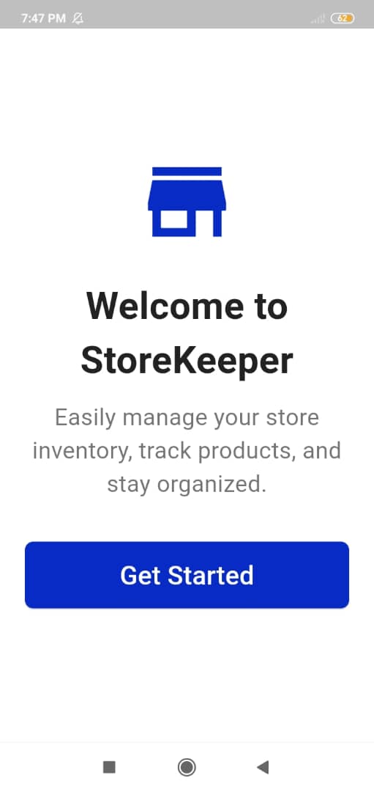
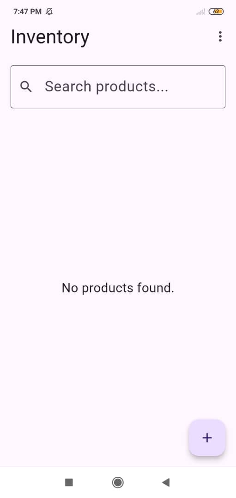
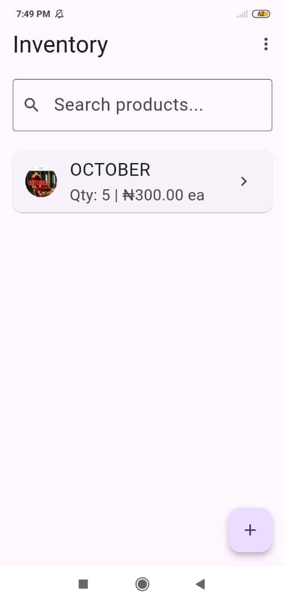
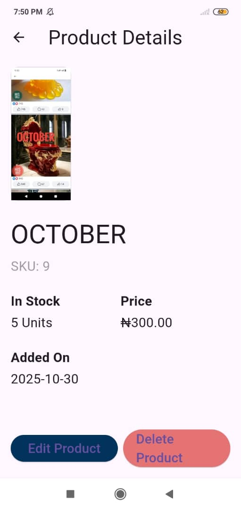

 StoreKeeper

 📋 Overview

StoreKeeper is a cross-platform mobile application designed for efficient and simplified management of store products. This application was created using flutter, dart and SQLite for my HNG Stage 2 Task, providing a robust, locally-persisted solution for tracking and managing inventory data.

 ✨ Features

* Product Management: Easily add new products, view a complete list of current products, and delete obsolete entries.
* Detail Viewing & Editing: Update product information (name, quantity, price, etc.) in a simple, intuitive interface.
* Local Data Persistence: All product information is securely stored locally using SQLite, ensuring fast and reliable access without an internet connection.
* Intuitive User Interface: A clean, modern, and responsive UI built with Flutter to provide a smooth user experience.

  📸 App Preview

See the application in action with a few key screens:

  Welcome Screen:
  

  Home Page:
  

  Product Screen:
  

  Overview Screen:
  


 💻 Tech Stack

The StoreKeeper application is built using the following core technologies:

| Technology | Description |
| :--- | :--- |
| Flutter | Frontend Framework for building natively compiled applications for mobile, web, and desktop from a single codebase. |
| Dart | The programming language used by Flutter. |
| SQLite | Lightweight, file-based database used for local data persistence and product storage. |


 Getting Started

Follow these instructions to set up and run the project locally.

 Prerequisites

* Flutter SDK: Ensure you have the Flutter SDK installed on your system.
    * Check installation: `flutter doctor`
* Dart SDK: Included with Flutter.

 Installation

1.  Clone the repository:
    ```bash
    git clone [https://github.com/Alexa-dev-ops/storekeeper.git](https://github.com/Alexa-dev-ops/storekeeper.git)
    cd storekeeper
    ```

2.  Install dependencies:
    ```bash
    flutter pub get
    ```

3.  Run the application:
    Ensure you have an active emulator or a physical device connected, then run:
    ```bash
    flutter run
    ```


 📺 Demo & Links

Attached are links to show my work. You can explore the live application and watch a video demonstration of its functionality via the links below:

* Appetize link to view the apk: [View Application](https://appetize.io/app/b_q4pnxsgfgwvymtkd2plivr6wry)
* Google Drive APK Link: [Download APK](https://drive.google.com/file/d/1AB7yaSKlwVEhkNIPaHfuebjvUVtfsCCi/view?usp=drive_link)
* Demo Video: [Watch Demonstration](https://drive.google.com/file/d/1Ul92yLI4NGOuHypheyVKAWkPT3dpPDDr/view?usp=drive_link)
* Github repo: [Repository Link](https://github.com/Alexa-dev-ops/storekeeper)


🤝 Contributing

Contributions are always welcome! If you have suggestions for improving this project, please feel free to fork the repository and submit a pull request.

1.  Fork the Project
2.  Create your Feature Branch (`git checkout -b feature/AmazingFeature`)
3.  Commit your Changes (`git commit -m 'feat: Add some AmazingFeature'`)
4.  Push to the Branch (`git push origin feature/AmazingFeature`)
5.  Open a Pull Request

👤 Author

* Alexa-dev-ops - [GitHub Profile](https://github.com/Alexa-dev-ops)

 📄 License

This project is currently unlicensed. Please refer to the repository owner for licensing details.
